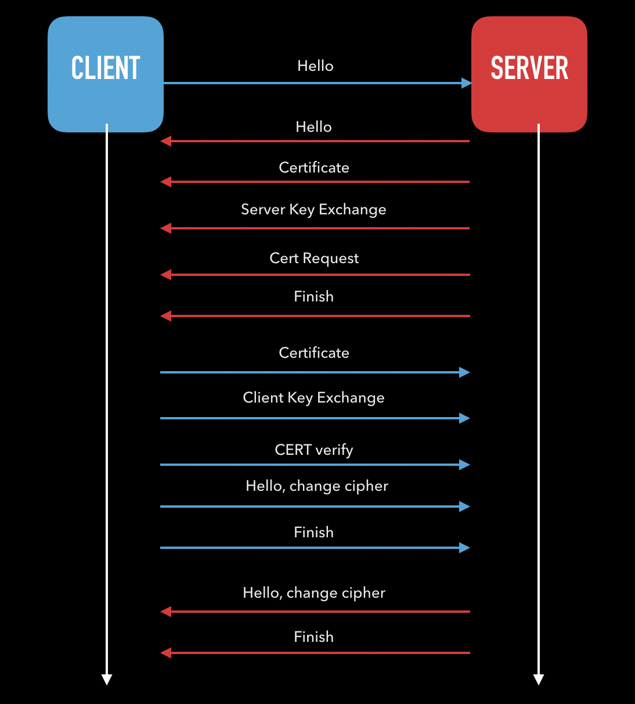

# pg-springboot-x509-auth

Playground repository to build Mutual Authentication Over TLS (`mTLS`) or Mutual Authentication Over SSL (`mSSL`) with Spring Boot.


## What is mSSL / mTLS?

Mutual authentication over SSL / TLS is the mechanism of establishing trust between two parties communicating with each other via the means of exchanging certificates issued by trusted CAs. 

## Why mSSL / mTLS?

With the modern architecture applications are being deployed on distributed systems and there is a need to build a mechanism of trust by which a service can trust another service without having to exchange username and pass etc. `mTLS` / `mSSL` is one way of solving the above problem.

Following image depicts a generic client-server `mTLS` handshake.  



In my experience getting this initial handshake right is the biggest hurdle. And I have seen many devs waste eons on trying to debug 403, 503 without looking for the obvious SSL handshake problems.

## How to debug?

We can deubg some of the common issues with this handshake using just `cURL` and enabling verbose logging on our application (java based spring boot app in our example)


## Sample Application
In this example we will look at setting up a Spring Boot application which plays the role of server which checks the CN in the client cert. Then we will try to hit this service using cURL and try to debug our way through the 401, 403 etc.


## Contents

- Spring Boot app built using gradle
    - Config.java extends WebSecurityConf
    - HelloWorld.java provides rest endpoints

- Certificate generation script (bin/gencert.sh)
- Dockerfile

## Setup

### Generate certs (first time only)

`docker-compose run openssl`

OR ( needs openssl installed )

`bin/gencert.sh`

### Generate jks (first time only)

`docker-compose run javastores`

OR

`bin/jks.sh`

### Run server (locally)

`docker-compose run -p 8443:8443 msslserver`

The above command will the build the docker image from the Dockerfile and then run it.

## Deploy mSSL server to kubernetes

`bin/deploy.sh`

## Testing mutual auth over SSL (mSSL / mTLS)

`msslServer` has two endpoints

- `/`: This is a secure endpoint which can only be accessed by the app which presents a valid ssl cert. For our example we will verify that the CN in the certificate is `msslapp`.
- `/insecure`: This is a insecure endpoint which can be accessed without a valid ssl cert. This can be used for liveness / readiness probes.

We will leverage cURL in order to test mSSL.

###  Test `/` without cert

`curl -v -k  https://localhost:8443/` 

should give you output as follows
```json
{"timestamp":"2019-03-16T11:19:01.325+0000","status":403,"error":"Forbidden","message":"Access Denied","path":"/"}
```

`curl --cert .pki/msslapp.crt --key .pki/msslapp.key --cacert .pki/rootCA.crt  -v -k  https://localhost:8443/`

should give you output as follows
```json
{"message":"Hello Secure World! msslapp"}
``` 